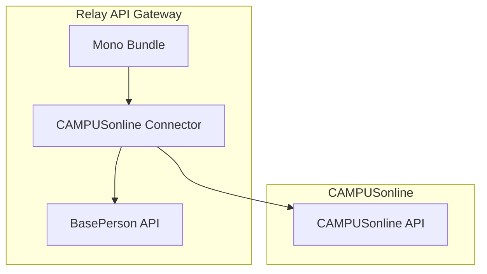

# Mono CAMPUSonline Connector

Source: https://github.com/digital-blueprint/relay-mono-connector-campusonline-bundle



The CAMPUSonline Connector currently provides support for paying the semester
tuition fee.

It uses the CO APIs and the base person API to gather information about the
authorized user and forwards this to the configured payment provider. Once the
payment is completed the payment status is stored in CAMPUSonline (which, in
Austria at least, will forward the information to the central tuition fee
register)

## Bundle installation

You can install the bundle directly from [packagist.org](https://packagist.org/packages/dbp/relay-mono-connector-campusonline-bundle).

```bash
composer require dbp/relay-mono-connector-campusonline-bundle
```

## Installation Requirements

* CAMPUSonline

## Documentation

* [Configuration](./config.md)
