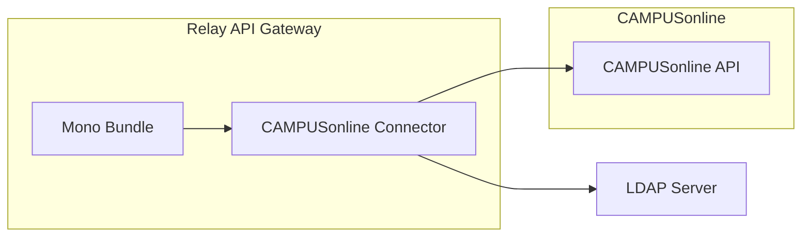

# Mono CAMPUSonline Connector

Source: https://github.com/digital-blueprint/relay-mono-connector-campusonline-bundle



The CAMPUSonline Connector currently provides support for paying the semester
tuition fee.

It uses the CO APIs and LDAP to gather information about the authorized user and
forwards this to the configured payment provider. Once the payment is completed
the payment status is stored in CAMPUSonline (which, in Austria at least, will
forward the information to the central tuition fee register)

## Configuration

```yaml
dbp_relay_mono_connector_campusonline:
    payment_types:        # Required
        # Prototype
        -
            api_url:              ~ # Required
            client_id:            ~ # Required
            client_secret:        ~ # Required
            ldap_host:            ~ # Required
            ldap_base_dn:         ~ # Required
            ldap_username:        ~ # Required
            ldap_password:        ~ # Required
            # simple_tls uses port 636 and is sometimes referred to as "SSL", start_tls uses port 389 and is sometimes referred to as "TLS"
            ldap_encryption:      start_tls # One of "start_tls"; "simple_tls"
            ldap_identifier_attribute: ~ # Required
            ldap_obfuscated_id_attribute: ~ # Required
            ldap_given_name_attribute: ~
            ldap_family_name_attribute: ~
```
